# 📊 SimulaRifas - Diccionario de Funciones y API Reference

## 🏗️ **ARQUITECTURA GENERAL**

```mermaid
graph TB
    A[🌐 Navegador del Usuario] --> B[📄 index.html - SPA]
    B --> C[🎨 styles.css - Estilos]
    B --> D[⚙️ app.js - Lógica Frontend]
    D --> E[🔗 Express Server - Backend]
    E --> F[🗄️ SQLite Database]
    E --> G[🔐 JWT Authentication]
    
    subgraph "🎯 FRONTEND LAYERS"
        H[🧭 Navegación] --> I[📱 Páginas SPA]
        I --> J[🎮 Funcionalidades]
        J --> K[🔔 Notificaciones]
    end
    
    subgraph "⚙️ BACKEND LAYERS"  
        L[🛣️ Routes] --> M[🔐 Middleware]
        M --> N[🎯 Controllers]
        N --> O[📊 Database Queries]
    end
```



---

## 📚 **DICCIONARIO DE FUNCIONES PRINCIPALES**

### 🧭 **NAVEGACIÓN**
| Función | Archivo | Propósito | CSS Relacionado |
|---------|---------|-----------|-----------------|
| `navigateTo(page)` | app.js:130 | Router SPA principal | `.nav-links`, `.active` |
| `updateActiveNav(page)` | app.js:155 | Actualiza nav activo | `.nav-links a.active` |
| `toggleMobileMenu()` | app.js:128 | Menu responsive | `.nav-links.active` |

### 🔐 **AUTENTICACIÓN**
| Función | Archivo | Endpoint | Base de Datos |
|---------|---------|----------|---------------|
| `checkAuthStatus()` | app.js:58 | GET /api/auth/me | users table |
| `showAuthModal()` | app.js:100 | - | - |
| `switchAuthMode()` | app.js:115 | - | - |
| `logout()` | app.js:271 | POST /api/auth/logout | - |
| `updateNavForLoggedUser()` | app.js:82 | - | `.user-info`, `.nav-user` |

### 🎮 **SIMULADOR DEMO**
| Función | Archivo | Propósito | CSS Grid |
|---------|---------|-----------|----------|
| `showDemoPage()` | app.js:180 | Página principal demo | `.main-content` |
| `generateNumbersGrid()` | app.js:242 | Crea grid 00-99 | `.numbers-grid`, `.number-cell` |
| `toggleNumber(number)` | app.js:255 | Selección individual | `.number-cell.selected` |
| `selectRandomNumber()` | app.js:310 | Selección aleatoria | `.number-cell` |
| `drawWinner()` | app.js:340 | Sorteo ganador | `.number-cell.winner` |
| `updateCart()` | app.js:285 | Actualiza carrito | `.cart-items`, `.cart-count` |

### 🎯 **RIFAS PRIVADAS**
| Función | Archivo | Endpoint | Funcionalidad |
|---------|---------|----------|---------------|
| `showPerfilPage()` | app.js:600 | GET /api/rifas/my | Lista rifas usuario |
| `viewRifa(rifaId)` | app.js:850 | GET /api/rifas/my/:id | Vista detallada FASE 1+2+3 |
| `editRifa(rifaId)` | app.js:1100 | PUT /api/rifas/:id | Editar simulación |
| `deleteRifa(rifaId)` | app.js:1130 | DELETE /api/rifas/:id | Eliminar simulación |
| `participateInRifa()` | app.js:770 | POST /api/rifas/:id/participate | Participar en rifa |
| `drawRifaWinner()` | app.js:1160 | POST /api/rifas/:id/draw | Realizar sorteo |

### 🔑 **ACCESO POR CÓDIGO**
| Función | Archivo | Endpoint | Flujo |
|---------|---------|----------|-------|
| `showCodigoPage()` | app.js:550 | - | Página código |
| `handleAccessCodeSubmit()` | app.js:1450 | GET /api/rifas/access/:code | Buscar por código |
| `viewRifaByCode()` | app.js:1480 | - | Vista participante |
| `generateRifaGrid()` | app.js:1620 | - | Grid interactivo |

### 📊 **FASE 1: Vista Administrativa**
| Función | Archivo | Endpoint | Propósito |
|---------|---------|----------|-----------|
| `loadParticipants(rifaId)` | app.js:1780 | GET /api/rifas/:id/participants | Lista participantes |
| Generación HTML automática | app.js:1800 | - | Lista con contadores |

### ⏰ **FASE 2: Timestamps Informativos**
| Función | Archivo | Endpoint | CSS Tooltip |
|---------|---------|----------|-------------|
| `loadNumbersWithTimestamps()` | app.js:1650 | GET /api/rifas/:id/numbers | Datos con timestamps |
| `showTooltip(event)` | app.js:1680 | - | `.custom-tooltip` |
| `hideTooltip()` | app.js:1710 | - | `#activeTooltip` |

### 🗑️ **FASE 3: Gestión de Números**
| Función | Archivo | Endpoint | Confirmación |
|---------|---------|----------|-------------|
| `removeUserNumber()` | app.js:85 | DELETE /api/rifas/:id/numbers/:number | Modal custom |
| `removeAllUserNumbers()` | app.js:105 | DELETE /api/rifas/:id/participants/:user/numbers | Modal custom |
| `showDeleteConfirmation()` | app.js:25 | - | `.delete-confirmation-modal` |
| `removeNumberFromGrid()` | app.js:125 | DELETE /api/rifas/:id/numbers/:number | Grid con botón X |

### 🔔 **SISTEMA DE NOTIFICACIONES**
| Función | Archivo | Propósito | CSS |
|---------|---------|-----------|-----|
| `showNotification(message, type)` | app.js:140 | Mostrar alertas | `.notification`, `.notification.error` |

---

## 🗄️ **ESTRUCTURA DE BASE DE DATOS**

### **Tablas Principales:**
```sql
-- Usuarios registrados
users: id, username, email, password_hash, created_at

-- Simulaciones de rifas
rifas: id, user_id, title, description, access_code, status, created_at

-- Participaciones en rifas (ACTUALIZADA FASE 3)
rifa_numbers: id, rifa_id, participant_name, number, selected_at
```

---

## 🛣️ **RUTAS API BACKEND**

### **🔐 Autenticación (/api/auth)**
| Method | Endpoint | Middleware | Función |
|--------|----------|------------|---------|
| POST | `/register` | - | Crear usuario |
| POST | `/login` | - | Iniciar sesión |
| GET | `/me` | authenticateToken | Datos usuario actual |
| POST | `/logout` | - | Cerrar sesión |

### **🎯 Rifas (/api/rifas)**
| Method | Endpoint | Middleware | Función | **FASE** |
|--------|----------|------------|---------|----------|
| GET | `/` | - | Rifas públicas | Base |
| POST | `/` | authenticateToken | Crear rifa | Base |
| GET | `/my` | authenticateToken | Mis rifas | Base |
| GET | `/my/:id` | authenticateToken | Mi rifa específica | Base |
| PUT | `/:id` | authenticateToken | Actualizar rifa | Base |
| DELETE | `/:id` | authenticateToken | Eliminar rifa | Base |
| GET | `/access/:code` | - | Acceso por código | Base |
| POST | `/:id/participate` | - | Participar | Base |
| POST | `/:id/draw` | authenticateToken | Realizar sorteo | Base |
| GET | `/:id/participants` | authenticateToken | **FASE 1**: Lista participantes | **FASE 1** |
| GET | `/:id/numbers` | - | **FASE 2**: Números con timestamps | **FASE 2** |
| DELETE | `/:id/numbers/:number` | authenticateToken | **FASE 3**: Eliminar número individual | **FASE 3** |
| DELETE | `/:id/participants/:user/numbers` | authenticateToken | **FASE 3**: Eliminar todos números usuario | **FASE 3** |

---

## 🎨 **CLASES CSS IMPORTANTES**

### **🧭 Navegación**
```css
.navbar - Barra navegación fija
.nav-container - Contenedor flex
.nav-links - Enlaces navegación
.nav-links.active - Menu móvil activo
.nav-user - Sección usuario
```

### **🎮 Simulador**
```css
.numbers-grid - Grid 10x10 números
.number-cell - Celda individual
.number-cell.selected - Número seleccionado
.number-cell.sold - Número ocupado
.number-cell.winner - Número ganador
.delete-number - Botón X eliminar (FASE 3)
```

### **🎯 Rifas**
```css
.rifas-grid - Grid tarjetas rifas
.rifa-card - Tarjeta individual
.rifa-progress - Barra progreso
.progress-fill - Relleno progreso
```

### **🔔 Notificaciones**
```css
.notification - Notificación éxito
.notification.error - Notificación error
```

### **⏰ FASE 2: Tooltips**
```css
.custom-tooltip - Tooltip timestamp
.custom-tooltip::after - Flecha tooltip
```

### **🗑️ FASE 3: Eliminación**
```css
.delete-confirmation-modal - Modal confirmación
.delete-confirmation-content - Contenido modal
.delete-confirmation-btn - Botones confirmar/cancelar
.grid-number-delete - Botón X en grilla
```

---

## 🚦 **ESTADO ACTUAL DEL PROYECTO**

### **✅ COMPLETADO**
- ✅ **Sistema base completo** funcionando
- ✅ **FASE 1**: Vista administrativa con lista de participantes
- ✅ **FASE 2**: Tooltips con timestamps informativos
- ✅ **FASE 3**: Gestión de números con eliminación individual/masiva

### **🐛 BUGS CORREGIDOS EN FASE 3**
- ✅ **"undefined" en participantes**: Problema de referencia corregido
- ✅ **Ruta duplicada backend**: Eliminada ruta conflictiva `/participants`
- ✅ **Consulta SQL**: Cambiado `created_at` por `selected_at`
- ✅ **Función loadParticipants**: Corregida estructura de retorno

### **🎯 PRÓXIMAS FASES**
- 📅 **FASE 4**: Colores únicos por participante
- 📅 **FASE 5**: Layout responsivo mejorado
- 📅 **FASE 18**: Migración a Firebase/Firestore

---

## 🔧 **HERRAMIENTAS DE DEBUG**

### **Frontend Console**
```javascript
// Ver variables globales
console.log('Current User:', currentUser);
console.log('Selected Numbers:', selectedNumbers);
console.log('Numbers with Tooltips:', numbersWithTooltips);

// FASE 3: Debug eliminación
console.log('🗑️ [DELETE] Eliminando número:', number, 'de usuario:', userName);
```

### **Network Tab**
- ✅ Monitorear requests a `/api/rifas`
- ✅ Verificar tokens JWT en headers
- ✅ Comprobar responses de endpoints
- ✅ **FASE 3**: Verificar requests DELETE a números

### **Backend Logs**
```bash
npm run dev  # Ver logs de servidor
# FASE 3 logs:
# 🗑️ [DELETE NUMBER] Eliminando número X de rifa Y
# ✅ [DELETE PARTICIPANT] X números eliminados para "usuario"
```

---

## 🎯 **COMANDOS ÚTILES**

```bash
# Backend
cd backend
npm run dev          # Servidor desarrollo
npm run init-db      # Inicializar DB
npm run demo-content # Contenido demo

# Testing FASE 3
# 1. Crear rifa con participantes
# 2. Probar eliminación individual: botón X en número
# 3. Probar eliminación masiva: botón "Todos" en participante
# 4. Verificar modal de confirmación
# 5. Confirmar actualización automática de grilla
```

---

## 📊 **RESUMEN DE FASES COMPLETADAS**

### **FASE 1: Vista Administrativa** ✅
- **Objetivo**: Lista de participantes para propietario
- **Archivos**: `backend/routes/rifas.js`, `public/js/app.js`
- **Resultado**: Tabla Usuario → Números con timestamps

### **FASE 2: Timestamps Informativos** ✅  
- **Objetivo**: Tooltips al hacer hover sobre números
- **Archivos**: Backend API, Frontend grid, CSS tooltips
- **Resultado**: "Elegido por [Usuario] el [fecha] a las [hora]"

### **FASE 3: Gestión de Números** ✅
- **Objetivo**: Eliminar números individual/masivamente  
- **Archivos**: Backend DELETE endpoints, Frontend modals
- **Resultado**: Botones X + "Todos" + modal confirmación
- **BUGFIX**: Corregido "undefined" en participantes

---

**📊 Este diccionario muestra el estado completo del proyecto hasta FASE 3, con todas las funciones, endpoints y características implementadas.**

*Actualizado: Agosto 2025 - Post FASE 3*  
*Proyecto: SimulaRifas Personal*  
*Estado: FASE 3 completada - Gestión de números operativa*
