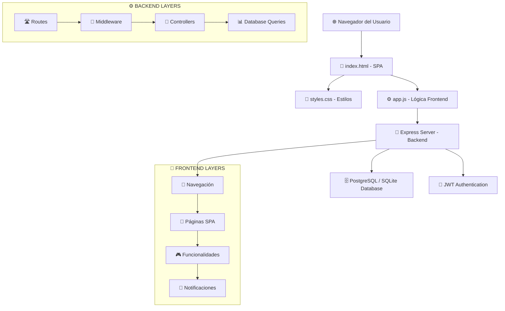

# 📊 SimulaRifas - Diccionario de Funciones y API Reference

## 🏗️ **ARQUITECTURA GENERAL**



---

## 📚 **DICCIONARIO DE FUNCIONES PRINCIPALES**

### 🧭 **NAVEGACIÓN**
| Función | Archivo | Propósito | CSS Relacionado |
|---------|---------|-----------|-----------------|
| `navigateTo(page)` | app.js:130 | Router SPA principal | `.nav-links`, `.active` |
| `updateActiveNav(page)` | app.js:155 | Actualiza nav activo | `.nav-links a.active` |
| `toggleMobileMenu()` | app.js:128 | Menu responsive | `.nav-links.active` |

### 🔐 **AUTENTICACIÓN**
| Función | Archivo | Endpoint | Base de Datos |
|---------|---------|----------|---------------|
| `checkAuthStatus()` | app.js:58 | GET /api/auth/me | users table |
| `showAuthModal()` | app.js:100 | - | - |
| `switchAuthMode()` | app.js:115 | - | - |
| `logout()` | app.js:271 | POST /api/auth/logout | - |
| `updateNavForLoggedUser()` | app.js:82 | - | `.user-info`, `.nav-user` |

### 🎮 **SIMULADOR DEMO**
| Función | Archivo | Propósito | CSS Grid |
|---------|---------|-----------|----------|
| `showDemoPage()` | app.js:180 | Página principal demo | `.main-content` |
| `generateNumbersGrid()` | app.js:242 | Crea grid 00-99 | `.numbers-grid`, `.number-cell` |
| `toggleNumber(number)` | app.js:255 | Selección individual | `.number-cell.selected` |
| `selectRandomNumber()` | app.js:310 | Selección aleatoria | `.number-cell` |
| `drawWinner()` | app.js:340 | Sorteo ganador | `.number-cell.winner` |
| `updateCart()` | app.js:285 | Actualiza carrito | `.cart-items`, `.cart-count` |

### 🎯 **RIFAS PRIVADAS**
| Función | Archivo | Endpoint | Funcionalidad |
|---------|---------|----------|---------------|
| `showPerfilPage()` | app.js:600 | GET /api/rifas/my | Lista rifas usuario |
| `viewRifa(rifaId)` | app.js:850 | GET /api/rifas/my/:id | Vista detallada FASE 1+2+3 |
| `editRifa(rifaId)` | app.js:1100 | PUT /api/rifas/:id | Editar simulación |
| `deleteRifa(rifaId)` | app.js:1130 | DELETE /api/rifas/:id | Eliminar simulación |
| `participateInRifa()` | app.js:770 | POST /api/rifas/:id/participate | Participar en rifa |
| `drawRifaWinner()` | app.js:1160 | POST /api/rifas/:id/draw | Realizar sorteo |

### 🔑 **ACCESO POR CÓDIGO**
| Función | Archivo | Endpoint | Flujo |
|---------|---------|----------|-------|
| `showCodigoPage()` | app.js:550 | - | Página código |
| `handleAccessCodeSubmit()` | app.js:1450 | GET /api/rifas/access/:code | Buscar por código |
| `viewRifaByCode()` | app.js:1480 | - | Vista participante |
| `generateRifaGrid()` | app.js:1620 | - | Grid interactivo |

### 📊 **FASE 1: Vista Administrativa**
| Función | Archivo | Endpoint | Propósito |
|---------|---------|----------|-----------|
| `loadParticipants(rifaId)` | app.js:1780 | GET /api/rifas/:id/participants | Lista participantes |
| Generación HTML automática | app.js:1800 | - | Lista con contadores |

### ⏰ **FASE 2: Timestamps Informativos**
| Función | Archivo | Endpoint | CSS Tooltip |
|---------|---------|----------|-------------|
| `loadNumbersWithTimestamps()` | app.js:1650 | GET /api/rifas/:id/numbers | Datos con timestamps |
| `showTooltip(event)` | app.js:1680 | - | `.custom-tooltip` |
| `hideTooltip()` | app.js:1710 | - | `#activeTooltip` |

### 🗑️ **FASE 3: Gestión de Números**
| Función | Archivo | Endpoint | Confirmación |
|---------|---------|----------|-------------|
| `removeUserNumber()` | app.js:85 | DELETE /api/rifas/:id/numbers/:number | Modal custom |
| `removeAllUserNumbers()` | app.js:105 | DELETE /api/rifas/:id/participants/:user/numbers | Modal custom |
| `showDeleteConfirmation()` | app.js:25 | - | `.delete-confirmation-modal` |
| `removeNumberFromGrid()` | app.js:125 | DELETE /api/rifas/:id/numbers/:number | Grid con botón X |

### 🎨 **FASE 4: Colores por Participante**
| Función | Archivo | Propósito | CSS |
|---------|---------|-----------|-----|
| `assignUserColor(participantName)` | app.js:2033 | Asigna color único a usuario | `.user-color-1` a `.user-color-12` |
| `getUserColor(participantName)` | app.js:2063 | Obtiene color asignado | - |
| `resetUserColors()` | app.js:2071 | Resetea mapa de colores | Variable `userColorMap` |

**Variables globales relacionadas:**
- `userColorMap` (app.js:15): Objeto que mapea usuario → número de color (1-12)
- **12 colores únicos** definidos en `styles.css` (líneas 1100-1240)

### 🎚️ **FASE 4.1: Toggle de Modos de Color**
| Función | Archivo | Propósito | CSS Responsive |
|---------|---------|-----------|----------------|
| `toggleColorMode(mode)` | app.js:2100 | Cambia entre modo simple/multi | `.color-mode-toggle`, `.color-mode-btn` |

**Variables globales relacionadas:**
- `colorMode` (app.js:19): String 'simple' o 'multi' para modo de visualización
- `currentRifa` (app.js:7): Rifa actual para regenerar grilla

**Modos disponibles:**
- **'simple'**: 2 colores (disponible/ocupado) - clase `.sold`
- **'multi'**: 12 colores únicos por participante - clases `.user-color-1` a `.user-color-12`

**CSS Relacionado:**
| Clase CSS | Archivo | Propósito | Responsive |
|-----------|---------|-----------|------------|
| `.color-mode-toggle-container` | styles.css:1304 | Container principal | Flexbox con wrap |
| `.color-mode-label` | styles.css:1317 | Label "Visualización:" | Oculto en mobile < 480px |
| `.color-mode-toggle` | styles.css:1330 | Grupo de botones | Background gris claro |
| `.color-mode-btn` | styles.css:1344 | Botones individuales | Padding adaptativo |
| `.color-mode-btn.active` | styles.css:1372 | Botón seleccionado | Gradiente morado/azul |

**Media Queries:**
- `@media (max-width: 768px)`: Reduce padding y fuente en tablets
- `@media (max-width: 480px)`: Oculta label, optimiza botones
- `@media (max-width: 360px)`: Padding mínimo para móviles pequeños

**Integración:**
- Toggle visible en `viewRifa()` (línea 2450) y `viewRifaByCode()` (línea 1892)
- Modifica comportamiento de `generateRifaGrid()` (línea 2201-2216)

### 📱 **FASE 5: Layout Responsivo Mejorado**
| Función | Archivo | Propósito | CSS Relacionado |
|---------|---------|-----------|-----------------|
| `initMobileEnhancements()` | app.js:2800 | Inicializa mejoras móviles | Touch events |
| `preventDoubleTapZoom()` | app.js:2820 | Previene zoom en double-tap | `touch-action` |
| `autoCloseMobileMenu()` | app.js:2840 | Cierra menú al navegar | `.nav-links` |
| `improveMobileModals()` | app.js:2860 | Swipe-down para cerrar | `.modal` |
| `addViewportDebugger()` | app.js:2880 | Debug de viewport (dev) | Overlay info |

**Variables globales relacionadas:**
- Detección automática de dispositivos táctiles
- 6 breakpoints optimizados (360px, 480px, 600px, 768px, 1024px, 1200px)

**CSS Media Queries:**
- `> 1200px` - Large Desktop
- `≤ 1024px` - Tablet Landscape
- `≤ 768px` - Tablet Portrait
- `≤ 600px` - Landscape Phone
- `≤ 480px` - Mobile Portrait
- `≤ 360px` - Small Mobile

### 🎲 **FASE 6: Botón Sorteo Directo**
| Función | Archivo | Propósito | CSS Relacionado |
|---------|---------|-----------|-----------------|
| `quickDraw(rifaId, rifaTitle)` | app.js:3000 | Inicia sorteo rápido | Modal confirmación |
| `closeQuickDrawModal()` | app.js:3020 | Cierra modal confirmación | `.quick-draw-modal` |
| `executeQuickDraw(rifaId, rifaTitle)` | app.js:3040 | Ejecuta sorteo | Spinner loading |
| `showQuickDrawResult(winner, rifaTitle)` | app.js:3080 | Muestra ganador | Modal resultado |
| `closeQuickDrawResultModal()` | app.js:3120 | Cierra modal resultado | Auto-refresh 3s |

**Animaciones CSS:**
- `@keyframes fadeOut` - Desvanecimiento
- `@keyframes slideUp` - Deslizar hacia arriba
- `@keyframes spin` - Spinner rotación
- `@keyframes bounce` - Rebote emoji 🏆
- `@keyframes winnerPulse` - Pulso ganador

### 📅 **FASE 7: Sistema de Fechas Programadas**
| Función | Archivo | Propósito | Base de Datos |
|---------|---------|-----------|---------------|
| `clearScheduledDate()` | app.js:3200 | Quita fecha programada | scheduled_draw_date |
| `checkAndExecuteScheduledDraw()` | rifas.js:500 | Verifica y ejecuta sorteo | Backend automático |
| `formatScheduledDate()` | app.js:3230 | Formato fecha DD/MM/YYYY | Locale es-AR |

**Event Listeners:**
- Contador de caracteres en mensaje (max 100)
- Toggle visibilidad según fecha seleccionada

**Campos nuevos en base de datos:**
- `scheduled_draw_date` (TIMESTAMP) - Fecha/hora del sorteo
- `owner_message` (TEXT) - Mensaje del propietario
- `timezone` (VARCHAR) - Zona horaria (default: America/Argentina/Buenos_Aires)

### 🖼️ **FASE 8: Sistema de Imágenes**
| Función | Archivo | Propósito | CSS Relacionado |
|---------|---------|-----------|-----------------|
| `switchImageMethod(method)` | app.js:3400 | Toggle URL/Upload (crear) | `.image-method-toggle` |
| `switchImageMethodEdit(method)` | app.js:3430 | Toggle URL/Upload (editar) | `.toggle-btn.active` |
| `handleImageUrlInput()` | app.js:3460 | Preview URL en tiempo real | `.image-preview-container` |
| `handleImageFileInput()` | app.js:3490 | Preview archivo local | `FileReader API` |
| `handleImageUrlInputEdit()` | app.js:3520 | Preview URL (editar) | - |
| `handleImageFileInputEdit()` | app.js:3550 | Preview archivo (editar) | - |
| `removeImagePreview()` | app.js:3580 | Quitar imagen (crear) | `.remove-image-btn` |
| `removeImagePreviewEdit()` | app.js:3600 | Quitar imagen (editar) | - |
| `uploadImageToCloudinary(file)` | app.js:3620 | Sube imagen a Cloudinary | POST /api/upload/image |
| `openLightbox(imageSrc)` | app.js:3700 | Abre modal ampliar imagen | `#imageLightbox` |
| `closeLightbox()` | app.js:3730 | Cierra lightbox | ESC key listener |
| `copyCode(code)` | app.js:3760 | Copia código al clipboard | Feedback visual |

**Funciones de modo sorteo (UI Base):**
| Función | Archivo | Propósito |
|---------|---------|-----------|
| `toggleSorteoModeVisibility()` | app.js:3800 | Muestra/oculta switch modo (crear) |
| `toggleSorteoModeVisibilityEdit()` | app.js:3820 | Muestra/oculta switch modo (editar) |
| `updateSorteoModeDescription()` | app.js:3840 | Actualiza descripción modo (crear) |
| `updateSorteoModeDescriptionEdit()` | app.js:3860 | Actualiza descripción modo (editar) |

**Variables globales relacionadas:**
- `currentImageUrl` (app.js) - URL de imagen en modal crear
- `editImageUrl` (app.js) - URL de imagen en modal editar

**Privacy fixes (funciones actualizadas):**
- `closeEditRifaModal()` - Reset completo del form + cleanup
- `closeCreateRifaModal()` - Reset completo del form + cleanup

### 🔔 **SISTEMA DE NOTIFICACIONES**
| Función | Archivo | Propósito | CSS |
|---------|---------|-----------|-----|
| `showNotification(message, type)` | app.js:140 | Mostrar alertas | `.notification`, `.notification.error` |

---

## 🗄️ **ESTRUCTURA DE BASE DE DATOS**

### **Sistema Dual SQLite ↔ PostgreSQL**
- **🏠 Desarrollo Local**: SQLite (archivo `rifas.db`)
- **☁️ Producción (Vercel)**: PostgreSQL (Vercel Postgres)
- **Switch automático** basado en `POSTGRES_URL`

### **Tablas Principales:**
```sql
-- Usuarios registrados
users: id, username, email, password_hash, created_at

-- Simulaciones de rifas (ACTUALIZADA FASE 8)
rifas: id, user_id, title, description, access_code, status, created_at,
       winner_number, winner_name,
       scheduled_draw_date,  -- FASE 7: Fecha programada
       owner_message,        -- FASE 7: Mensaje propietario (max 100 chars)
       timezone,             -- FASE 7: Zona horaria
       image_url             -- FASE 8: URL de imagen (Cloudinary o externa)

-- Participaciones en rifas (ACTUALIZADA FASE 3)
rifa_numbers: id, rifa_id, participant_name, number, selected_at
```

### **Configuración Cloudinary (FASE 8):**
```javascript
// backend/config/cloudinary.js
cloudinary.config({
  cloud_name: process.env.CLOUDINARY_CLOUD_NAME,
  api_key: process.env.CLOUDINARY_API_KEY,
  api_secret: process.env.CLOUDINARY_API_SECRET
});

// Carpeta: simularifas/
// Límite: 800x800px
// Quality: auto:good
```

---

## 🛣️ **RUTAS API BACKEND**

### **🔐 Autenticación (/api/auth)**
| Method | Endpoint | Middleware | Función |
|--------|----------|------------|---------|
| POST | `/register` | - | Crear usuario |
| POST | `/login` | - | Iniciar sesión |
| GET | `/me` | authenticateToken | Datos usuario actual |
| POST | `/logout` | - | Cerrar sesión |

### **🎯 Rifas (/api/rifas)**
| Method | Endpoint | Middleware | Función | **FASE** |
|--------|----------|------------|---------|----------|
| GET | `/` | - | Rifas públicas | Base |
| POST | `/` | authenticateToken | Crear rifa | Base |
| GET | `/my` | authenticateToken | Mis rifas | Base |
| GET | `/my/:id` | authenticateToken | Mi rifa específica | Base |
| PUT | `/:id` | authenticateToken | Actualizar rifa | Base |
| DELETE | `/:id` | authenticateToken | Eliminar rifa | Base |
| GET | `/access/:code` | - | Acceso por código | Base |
| POST | `/:id/participate` | - | Participar | Base |
| POST | `/:id/draw` | authenticateToken | Realizar sorteo | Base |
| GET | `/:id/participants` | authenticateToken | **FASE 1**: Lista participantes | **FASE 1** |
| GET | `/:id/numbers` | - | **FASE 2**: Números con timestamps | **FASE 2** |
| DELETE | `/:id/numbers/:number` | authenticateToken | **FASE 3**: Eliminar número individual | **FASE 3** |
| DELETE | `/:id/participants/:user/numbers` | authenticateToken | **FASE 3**: Eliminar todos números usuario | **FASE 3** |

### **🖼️ Upload de Imágenes (/api/upload) - FASE 8**
| Method | Endpoint | Middleware | Función | Límites |
|--------|----------|------------|---------|---------|
| POST | `/image` | authenticateToken, multer | Subir imagen a Cloudinary | 5MB, JPG/PNG/GIF/WEBP |
| DELETE | `/image/:publicId` | authenticateToken | Eliminar imagen de Cloudinary | - |

**Configuración Multer:**
- Storage: memoria (no disco)
- Límite: 5MB
- Formatos: image/jpeg, image/png, image/gif, image/webp

**Respuesta POST /api/upload/image:**
```json
{
  "success": true,
  "url": "https://res.cloudinary.com/...",
  "public_id": "simularifas/abc123"
}
```

---

## 🎨 **CLASES CSS IMPORTANTES**

### **🧭 Navegación**
```css
.navbar - Barra navegación fija
.nav-container - Contenedor flex
.nav-links - Enlaces navegación
.nav-links.active - Menu móvil activo
.nav-user - Sección usuario
```

### **🎮 Simulador**
```css
.numbers-grid - Grid 10x10 números
.number-cell - Celda individual
.number-cell.selected - Número seleccionado
.number-cell.sold - Número ocupado
.number-cell.winner - Número ganador
.delete-number - Botón X eliminar (FASE 3)
```

### **🎯 Rifas**
```css
.rifas-grid - Grid tarjetas rifas
.rifa-card - Tarjeta individual
.rifa-progress - Barra progreso
.progress-fill - Relleno progreso
```

### **🔔 Notificaciones**
```css
.notification - Notificación éxito
.notification.error - Notificación error
```

### **⏰ FASE 2: Tooltips**
```css
.custom-tooltip - Tooltip timestamp
.custom-tooltip::after - Flecha tooltip
```

### **🗑️ FASE 3: Eliminación**
```css
.delete-confirmation-modal - Modal confirmación
.delete-confirmation-content - Contenido modal
.delete-confirmation-btn - Botones confirmar/cancelar
.grid-number-delete - Botón X en grilla
```

### **🎨 FASE 4: Colores por Participante**
```css
.user-color-1 - Gradiente azul/cyan (Primer usuario)
.user-color-2 - Gradiente verde/esmeralda
.user-color-3 - Gradiente amarillo/naranja
.user-color-4 - Gradiente rojo/rosa
.user-color-5 - Gradiente púrpura/violeta
.user-color-6 - Gradiente índigo/azul profundo
.user-color-7 - Gradiente turquesa/menta
.user-color-8 - Gradiente coral/salmón
.user-color-9 - Gradiente lavanda/lila
.user-color-10 - Gradiente dorado/ámbar
.user-color-11 - Gradiente magenta/fucsia
.user-color-12 - Gradiente teal/verde azulado
```

### **🎚️ FASE 4.1: Toggle de Colores**
```css
.color-mode-toggle-container - Container toggle (flexbox)
.color-mode-label - Label "Visualización:"
.color-mode-toggle - Grupo de botones
.color-mode-btn - Botón individual
.color-mode-btn.active - Botón seleccionado
```

### **📱 FASE 5: Layout Responsivo**
```css
/* Tipografía fluida */
clamp() - Escalado automático títulos

/* Touch targets */
min-width: 44px - Mínimo táctil WCAG 2.1
min-height: 44px

/* Grid dinámico */
grid-template-columns: repeat(auto-fit, minmax(70px, 1fr)) - Desktop
grid-template-columns: repeat(10, 1fr) - Tablet
grid-template-columns: repeat(8, 1fr) - Mobile
grid-template-columns: repeat(6, 1fr) - Small mobile
```

### **🎲 FASE 6: Sorteo Directo**
```css
/* Animaciones */
@keyframes fadeOut - Desvanecimiento modal
@keyframes slideUp - Entrada desde abajo
@keyframes spin - Rotación spinner
@keyframes bounce - Rebote emoji ganador
@keyframes winnerPulse - Pulso número ganador

/* Cards completadas */
.rifa-card.completed - Fondo gris-verdoso
```

### **📅 FASE 7: Fechas Programadas**
```css
/* Badges de estado */
.badge-scheduled - Fondo azul (fecha futura)
.badge-overdue - Fondo rojo (fecha pasada)
.badge-manual - Fondo gris (sin fecha)
.badge-message - Fondo naranja (mensaje propietario)
```

### **🖼️ FASE 8: Sistema de Imágenes**
```css
/* Upload de imágenes */
.image-upload-container - Container principal
.image-method-toggle - Grupo toggle URL/Upload
.toggle-btn - Botón toggle (gradiente cuando active)
.toggle-btn.active - Botón seleccionado

/* Preview */
.image-preview-container - Container con sombra
.image-preview - Imagen responsiva (max 200px)
.remove-image-btn - Botón × absolute

/* Visualización en rifas */
.prize-image-container - Container sidebar (contain)
.prize-image-container-header - Container banner (cover, 250px)
.prize-image - Imagen sidebar (object-fit: contain)
.prize-image-header - Imagen banner (object-fit: cover)
.rifa-card-image-container - Container card (120px)
.rifa-card-image - Imagen card (object-fit: cover, centered)

/* Lightbox */
#imageLightbox - Overlay oscuro (rgba(0,0,0,0.95))
#lightboxImage - Imagen ampliada (max 90vw/90vh)
.lightbox-close-btn - Botón × cerrar

/* Códigos destacados */
.codigo-destacado - Gradiente morado (#667eea → #764ba2)
/* Font monospace, 1.3rem, letter-spacing: 2px */

/* Cards completadas */
.rifa-card-completed - Fondo verde gradient + borde 3px

/* Medalla ganador mobile */
.number-cell.winner::before - Posición ajustada (top: -20px, right: -5px)

/* Navegación reorganizada */
#codigoBtn - Botón ACCESO POR CÓDIGO (gradiente morado)
#authLinkMobile - Iniciar Sesión en hamburguesa
```

---

## 🚦 **ESTADO ACTUAL DEL PROYECTO**

### **✅ COMPLETADO**
- ✅ **Sistema base completo** funcionando
- ✅ **Migración PostgreSQL** - Sistema dual SQLite/PostgreSQL
- ✅ **FASE 1**: Vista administrativa con lista de participantes
- ✅ **FASE 2**: Tooltips con timestamps informativos
- ✅ **FASE 3**: Gestión de números con eliminación individual/masiva
- ✅ **FASE 4**: Colores únicos por participante (12 gradientes)
- ✅ **FASE 4.1**: Toggle de modos de color (simple/multi-color)
- ✅ **FASE 5**: Layout responsivo mejorado (6 breakpoints, touch-optimized)
- ✅ **FASE 6**: Botón sorteo directo desde "Mis Simulaciones"
- ✅ **FASE 7**: Sistema de fechas programadas (sorteo automático)
- ✅ **FASE 8**: Sistema de imágenes completo (Cloudinary, lightbox, UI mejorada)

### **🐛 BUGS CORREGIDOS**

**FASE 3:**
- ✅ **"undefined" en participantes**: Problema de referencia corregido
- ✅ **Ruta duplicada backend**: Eliminada ruta conflictiva `/participants`
- ✅ **Consulta SQL**: Cambiado `created_at` por `selected_at`

**FASE 8:**
- ✅ **Privacy bug crítico**: Imágenes de usuarios aparecían en otros modales
- ✅ **Imágenes cortando cabezas**: object-fit optimizado por contexto
- ✅ **Botón SORTEAR no aparecía**: Ahora siempre visible (grayed cuando vacío)
- ✅ **Imágenes no centradas**: object-position: center aplicado
- ✅ **Códigos difíciles de copiar**: Gradiente morado + font monospace grande

### **🎯 PRÓXIMAS FASES**
- 📅 **FASE 9**: Zona horaria del propietario
- 📅 **FASE 10**: Historial de cambios
- 📅 **FASE 11**: Rangos personalizables base
- 📅 **FASE 21**: Sistema de temas base
- 📅 **FASE 22**: Modo oscuro/claro

---

## 🔧 **HERRAMIENTAS DE DEBUG**

### **Frontend Console**
```javascript
// Ver variables globales
console.log('Current User:', currentUser);
console.log('Selected Numbers:', selectedNumbers);
console.log('Numbers with Tooltips:', numbersWithTooltips);

// FASE 3: Debug eliminación
console.log('🗑️ [DELETE] Eliminando número:', number, 'de usuario:', userName);

// FASE 4: Debug colores
console.log('🎨 [FASE 4] Mapa de colores:', userColorMap);
console.log('🎨 [FASE 4] Color de usuario:', getUserColor('nombreUsuario'));

// FASE 4.1: Debug toggle de modos
console.log('🎚️ [FASE 4.1] Modo de color actual:', colorMode);
console.log('🎚️ [FASE 4.1] Rifa actual:', currentRifa);

// FASE 6: Debug sorteo directo
console.log('🎲 [FASE 6] Ejecutando sorteo rápido para rifa:', rifaId);

// FASE 7: Debug fechas programadas
console.log('📅 [FASE 7] Fecha programada:', scheduled_draw_date);
console.log('📅 [FASE 7] Mensaje propietario:', owner_message);

// FASE 8: Debug imágenes
console.log('🖼️ [FASE 8] URL imagen actual (crear):', currentImageUrl);
console.log('🖼️ [FASE 8] URL imagen actual (editar):', editImageUrl);
console.log('🖼️ [FASE 8] Lightbox abierto con:', imageSrc);
```

### **Network Tab**
- ✅ Monitorear requests a `/api/rifas`
- ✅ Verificar tokens JWT en headers
- ✅ Comprobar responses de endpoints
- ✅ **FASE 3**: Verificar requests DELETE a números

### **Backend Logs**
```bash
npm run dev  # Ver logs de servidor
# FASE 3 logs:
# 🗑️ [DELETE NUMBER] Eliminando número X de rifa Y
# ✅ [DELETE PARTICIPANT] X números eliminados para "usuario"
```

---

## 🎯 **COMANDOS ÚTILES**

```bash
# Backend
cd backend
npm run dev          # Servidor desarrollo
npm run init-db      # Inicializar DB
npm run demo-content # Contenido demo

# Testing FASE 3
# 1. Crear rifa con participantes
# 2. Probar eliminación individual: botón X en número
# 3. Probar eliminación masiva: botón "Todos" en participante
# 4. Verificar modal de confirmación
# 5. Confirmar actualización automática de grilla
```

---

## 📊 **RESUMEN DE FASES COMPLETADAS**

### **FASE 1: Vista Administrativa** ✅
- **Objetivo**: Lista de participantes para propietario
- **Archivos**: `backend/routes/rifas.js`, `public/js/app.js`
- **Resultado**: Tabla Usuario → Números con timestamps

### **FASE 2: Timestamps Informativos** ✅  
- **Objetivo**: Tooltips al hacer hover sobre números
- **Archivos**: Backend API, Frontend grid, CSS tooltips
- **Resultado**: "Elegido por [Usuario] el [fecha] a las [hora]"

### **FASE 3: Gestión de Números** ✅
- **Objetivo**: Eliminar números individual/masivamente
- **Archivos**: Backend DELETE endpoints, Frontend modals
- **Resultado**: Botones X + "Todos" + modal confirmación
- **BUGFIX**: Corregido "undefined" en participantes

### **FASE 4: Colores por Participante** ✅
- **Objetivo**: Diferenciar usuarios visualmente
- **Archivos**: Frontend CSS (12 gradientes), app.js
- **Resultado**: Cada usuario con color único persistente

### **FASE 5: Layout Responsivo Mejorado** ✅
- **Objetivo**: Optimizar UX en todos los dispositivos
- **Archivos**: CSS con 6 breakpoints, mejoras touch
- **Resultado**: Mobile-first, touch-optimized, WCAG 2.1

### **FASE 6: Botón Sorteo Directo** ✅
- **Objetivo**: Sortear sin entrar a detalles
- **Archivos**: app.js funciones quickDraw, CSS animaciones
- **Resultado**: Modal confirmación + resultado animado + auto-refresh

### **FASE 7: Sistema de Fechas Programadas** ✅
- **Objetivo**: Sorteo automático en fecha/hora específica
- **Archivos**: Backend checkAndExecuteScheduledDraw, Frontend badges
- **Resultado**: Sorteo automático, mensaje propietario, timezone

### **FASE 8: Sistema de Imágenes** ✅
- **Objetivo**: Agregar imágenes de premios a las rifas
- **Archivos**: Cloudinary config, upload routes, lightbox, UI mejorada
- **Resultado**: Upload/URL dual, lightbox, códigos destacados, privacy fix
- **BUGFIXES**: 6 bugs críticos resueltos (privacy, display, UX)

---

**📊 Este diccionario muestra el estado completo del proyecto hasta FASE 8, con todas las funciones, endpoints y características implementadas.**

*Actualizado: Noviembre 2025 - Post FASE 8*
*Proyecto: SimulaRifas Personal*
*Estado: FASE 8 COMPLETA - Sistema de imágenes operativo*
*Total: +10,000 líneas de código*
